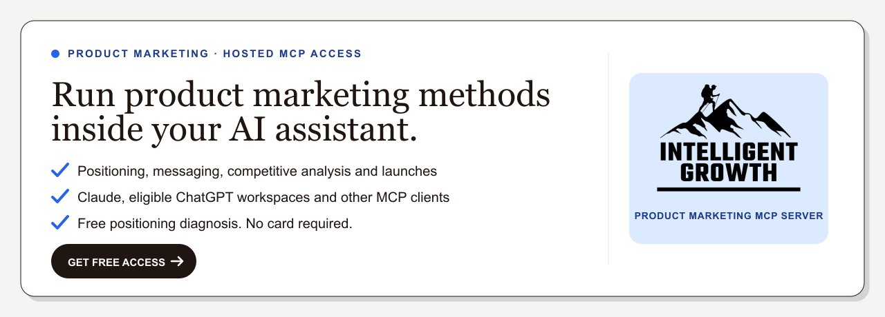

# Intelligent Growth product marketing MCP server

<p align="center">
  <a href="https://intelligentgrowth.app/mcp?utm_source=github&utm_medium=referral&utm_campaign=mcp_public_repo&utm_content=readme_banner">
    
  </a>
</p>

Intelligent Growth is a hosted product marketing MCP server for positioning, messaging, competitive analysis, launch planning and go-to-market work in Claude and ChatGPT.

Bring the homepage, customer evidence, launch brief or competitor set already on your desk. Intelligent Growth returns one recommendation, the reasoning behind it, the assumptions it made and a working deliverable you can improve.

[Start with the guided setup](https://intelligentgrowth.app/mcp/start?job=competitive-gap&utm_source=github&utm_medium=referral&utm_campaign=mcp_public_repo&utm_content=setup_cta).

## What is a product marketing MCP server?

A product marketing MCP server connects an MCP-compatible AI client to tools and context for repeatable jobs such as positioning reviews, competitive analysis and launch planning.

Intelligent Growth is hosted. You connect to the endpoint, complete the email access step and bring the context for the current job. You do not need to install or operate a local server.

## Product marketing jobs

Free access includes the competitive gap workflow and a positioning diagnosis. Full positioning recommendations, messaging reviews and launch workflows require the Intelligent Growth OS membership. Use your membership email during connection and full access loads automatically.

### Competitive analysis

Find repeated category claims, weakly owned territory and a credible opening.

```text
Use Intelligent Growth to run a competitive gap analysis for my product. Start by telling me the product context, customer evidence and competitor URLs you need. Do not begin the analysis until I have supplied the required context.
```

### Positioning review

Make one positioning recommendation and separate evidence from assumptions.

```text
Use Intelligent Growth to review my positioning. Ask for the audience, alternatives, customer evidence, current page and business goal first. Then recommend one direction, explain why it is stronger and tell me what still needs proof.
```

### Messaging review

Turn customer language, proof and objections into a message hierarchy the team can use.

```text
Use Intelligent Growth to review my messaging. Ask for the offer, audience, customer language, current message, available proof and common objections before you start.
```

### Launch planning

Decide what kind of launch the change deserves, then build the brief and actions.

```text
Use Intelligent Growth to plan this launch. Ask for the product change, audience, business goal, deadline, evidence, readiness, owners and constraints. Make the launch call before building the plan.
```

See [example jobs](docs/example-jobs.md) for the context to bring and the output to expect.

## Hosted connection

The recommended path is the [guided setup](https://intelligentgrowth.app/mcp/start?job=competitive-gap&utm_source=github&utm_medium=referral&utm_campaign=mcp_public_repo&utm_content=setup_cta), which gives current instructions for each supported client and a starter prompt.

```text
https://mcp.intelligentgrowth.app/mcp
```

### Claude Desktop

1. Open Customize, then Connectors.
2. Select +, then Add custom connector. Team and Enterprise owners may need to add it through organisation settings first.
3. Paste the hosted endpoint.
4. Complete the email access step.

### Claude Code, manual setup

```bash
claude mcp add intelligent-growth --transport http https://mcp.intelligentgrowth.app/mcp
```

Complete the browser access step, then return to Claude Code.

### ChatGPT

Custom MCP setup depends on your current ChatGPT workspace and plan. If your workspace supports custom apps or connectors, add Intelligent Growth with the hosted endpoint and OAuth. The guided setup page keeps the client-specific instructions current.

## What comes back

Each completed job returns:

- One clear recommendation.
- Reasoning tied to the context you supplied.
- Assumptions and missing evidence.
- A working deliverable you can edit.
- Relevant principles that help you understand the decision.

The useful result is not a generic list of ideas. It is a decision and a first version grounded in the material you brought.

## What this repository contains

This public companion repository includes:

- Connection instructions for supported AI clients.
- Safe starter prompts for common product marketing jobs.
- A public capability overview.
- Troubleshooting, privacy and security guidance.
- A clear description of the hosted product boundary.

This is the public companion for the hosted product. Your AI client receives the applied result for the job you asked it to do.

## How the boundary works

```text
Your AI client
    |
    | secure MCP request
    v
Hosted Intelligent Growth service
    |
    | applies the right method to your context
    v
Structured result returned to your AI client
```

The result can teach relevant principles, explain the process and show why a recommendation holds. It does not export protected method files, source libraries or the server implementation.

Read the [public architecture note](docs/architecture.md) for more detail.

## Privacy

Product analytics record safe events such as connection, method, access tier, client and outcome. They do not record prompts, outputs, email addresses, credentials, company text or full URLs.

Read the current [privacy policy](https://intelligentgrowth.app/privacy) and [terms](https://intelligentgrowth.app/terms).

## Frequently asked questions

### Do I need to install a local server?

No. Use the hosted endpoint above.

### Can I use it with Claude and ChatGPT?

It works with supported MCP-compatible clients. Claude Desktop and Claude Code have guided instructions. ChatGPT availability depends on the features enabled for your workspace and plan.

### What product marketing work can it do?

The public starting jobs cover competitive analysis, positioning, messaging and launch planning. The product page shows the current workflow catalogue.

### Will it teach me how to do the work?

The result can explain the relevant principles, show the reasoning behind its recommendation and make assumptions visible. It should help you understand and challenge the work, not only hand back an answer.

### Does analytics record my prompt or output?

No. The [Privacy](#privacy) section above lists the exact boundary.

## Support

- Setup guide: [intelligentgrowth.app/mcp/start](https://intelligentgrowth.app/mcp/start?job=competitive-gap&utm_source=github&utm_medium=referral&utm_campaign=mcp_public_repo&utm_content=support_setup)
- Troubleshooting: [docs/troubleshooting.md](docs/troubleshooting.md)
- Security reports: [SECURITY.md](SECURITY.md)
- Product issues and requests: use the GitHub issue templates

Never include access tokens, private company content, customer records or confidential prompts in an issue.
